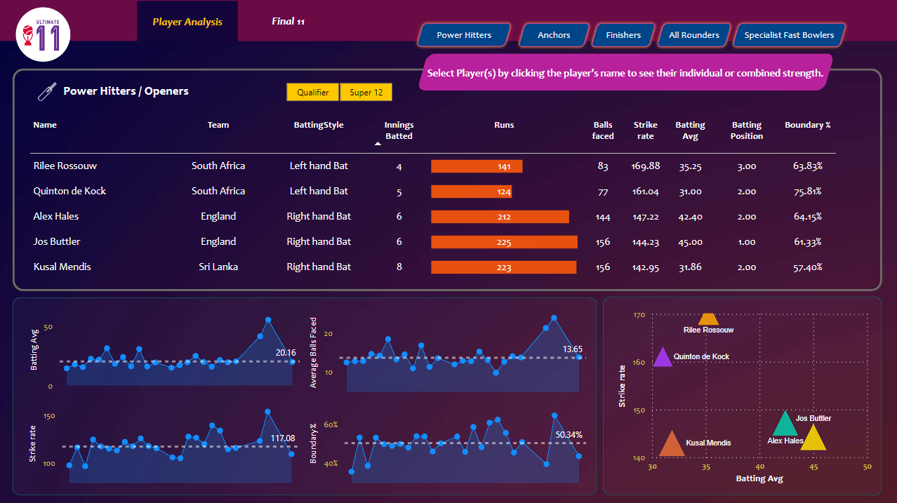
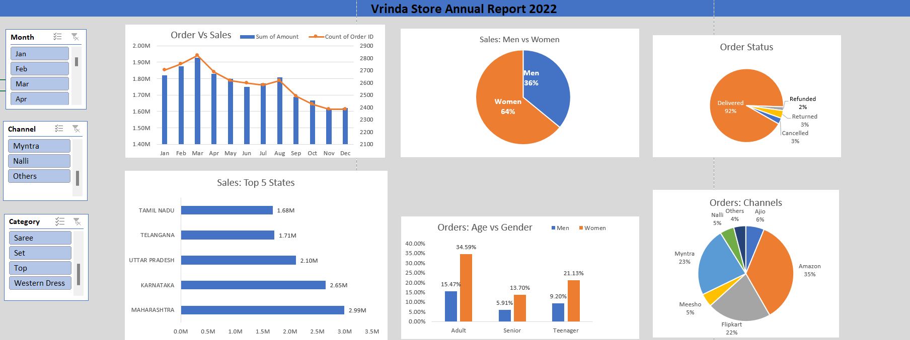

# Data Analysat

#### Technical Skills: Python, SQL, Power BI, Excel

## Education	        		
- B.Tech, ECE | Thiagarajar College Of Enginnering (May 2021)

## Work Experience
**L2 .Net Developer @ Wipro (_June 2021 - Present_)**
- Analyzed and inspecting different scenarios of occurrence for certain Bugs in Android as well as Windows UI of HP Printers. 
- Applied Unit testing for Migrating the Servers to LR0 Network to Improve the Cybersecurity.
- Collected Data and Introspected the same to determine different size of pages supported for various HP printers.
- Built Submenu for Diagnosing Sensor Test for SFP Products to automate the manual task and increase the efficiency by 70%.

**Data Scientist Intern @ Experian (_December 2019 - April 2020_)**
- As an Intern, created “IMAGE RETRIEVAL ALGORITHM” using Open CV and python in which for query image you will get desired output similar to that.

## Projects
### [Ultimate 11](https://github.com/koushaljk6/Ultimate-11)

* The project objective is to select the best 11 cricket players from the 2022 World Cup data.
* The project methodology is as follows:
  * Data collection: The data was sourced from the ESPN cricket info website, which provides comprehensive statistics and analysis of cricket matches and players.
  * Data cleaning and transformation: The data was processed and formatted according to the project requirements, such as filtering, grouping, aggregating, etc.
  * Data visualization and analysis: The data was visualized and explored using various features of Power BI, such as barchart, treemap, slicer, etc., to create a dashboard that shows the performance of each 
    player in different aspects, such as batting, bowling, fielding, etc.

* The project outcome is a dashboard that displays the best 11 cricket players from the 2022 World Cup data, based on various criteria and metrics, such as runs scored, wickets taken, matches played, strike
  rate, economy rate, etc. The dashboard also allows the user to interact with the data and filter it by different dimensions, such as team, match, player, etc.
## Overview of the Dashboard

### [Shopping Store Analysis](https://github.com/koushaljk6/Shopping-Store-Analysis)

* This project aims to create an annual sales report for Vrinda store for the year 2022, in order to help Vrinda understand their customers and grow more sales in 2023.
* The project involves data cleaning and data transformation, followed by data analysis and visualization in Excel, using the given data from Vrinda store.
* The project uses pivot tools and charts such as clustered column, pie, combo, bar, and slicer to create an interactive dashboard that displays the key metrics and trends of the sales performance and customer 
  behavior of Vrinda store in 2022.
* The project provides valuable insights and recommendations for Vrinda store to improve their sales and customer satisfaction in 2023, based on the data analysis and visualization results.
## Overview of the Dashboard

### To Be Continued
- [Projects in Progress](https://github.com/koushaljk6)
